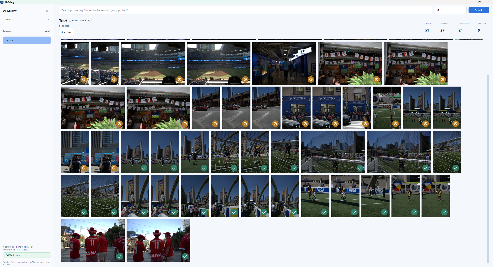
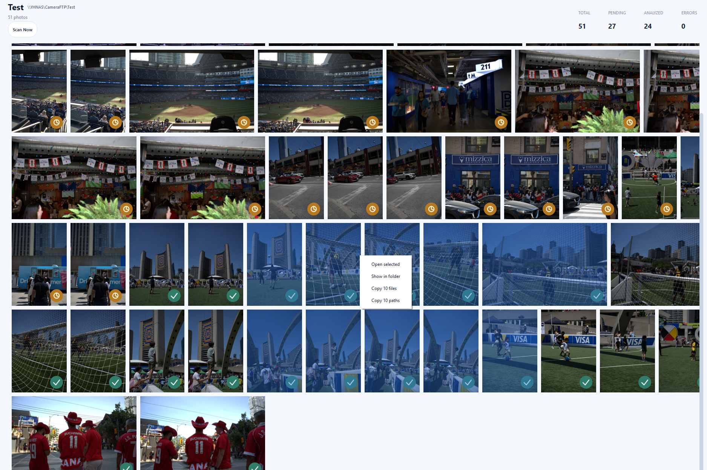
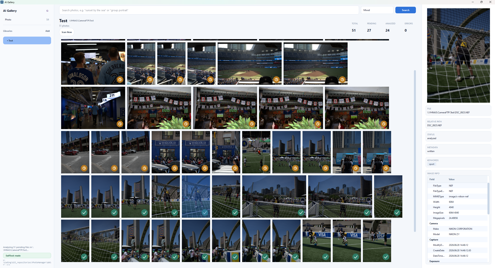
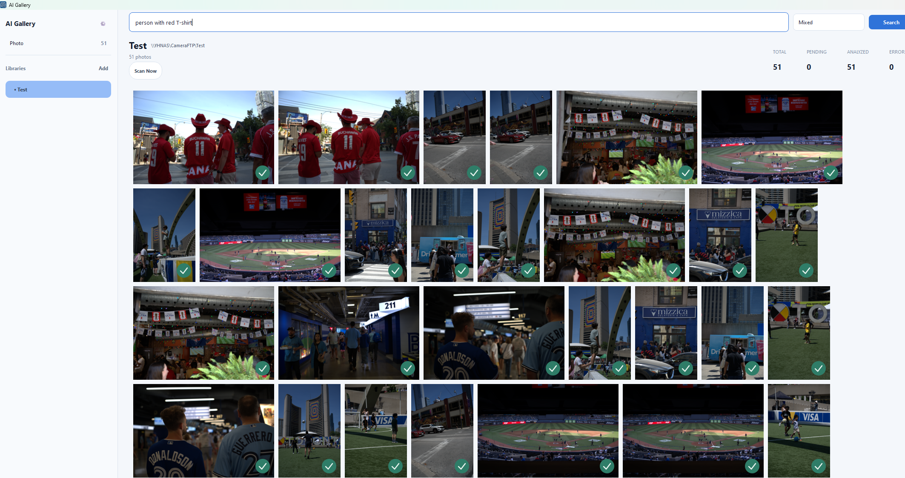
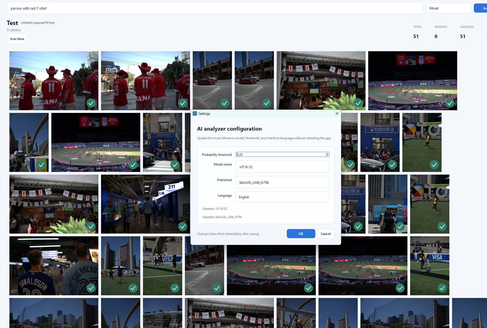

# VisionMind

**VisionMind is a desktop AI photo library manager for Windows and macOS.**
It scans large libraries incrementally, generates tags with `open-clip-torch`, stores semantic embeddings in a local FAISS vector database, and writes metadata in place with `ExifTool`.



## Highlights

- **Vector database built in**: semantic search runs on a local FAISS index, not a server.
- **RAW support**: reads and previews RAW files through `rawpy`.
- **Desktop only**: no background service, no web server, no Docker.
- **Incremental scan**: new and changed files are detected automatically while the app is open.
- **In-place metadata updates**: tags are written directly into the image file metadata.
- **GPU first**: OpenCLIP inference prefers GPU when available.
- **Large library ready**: designed for 100,000+ photos with local SQLite state and cached thumbnails.




## What It Does

VisionMind combines four local layers into one desktop workflow:

1. **Filesystem scanning**
   - Detects new, changed, and removed images incrementally.
   - Keeps scan state in SQLite so the app can recover after restart.

2. **AI analysis**
   - Uses `open-clip-torch` to infer photo tags.
   - Supports batch inference on independent worker threads.
   - Keeps model caches local for reuse.

3. **Vector search**
   - Stores image embeddings in a local FAISS index.
   - Supports semantic search by text query.
   - Can combine metadata search with vector retrieval.

4. **Metadata writing**
   - Uses `ExifTool` via `pyexiftool`.
   - Preserves existing tags.
   - Avoids duplicate tag injection.
   - Does not create sidecar copies.

## Core Capabilities

- Incremental library scanning
- Passive auto-detection while the app is open
- Thumbnail generation and local thumbnail cache
- Search bar at the top with button and Enter support
- Right-click file actions, multi-select, and native-style photo interactions
- Structured details panel for the selected photo
- UI language switching
- First-run bootstrap for AI model and ExifTool downloads




## How To Use

### 1. Launch the app

From source:

```bash
python -m src
```

Or use the packaged desktop build from GitHub Releases.

### 2. Add a library

- Open the app.
- Add a photo folder as a library.
- The library is stored in local SQLite state.

### 3. Let scanning run

- VisionMind monitors the library while the app stays open.
- New files and modified files are picked up automatically.
- Deleted libraries can be removed from the sidebar and stay removed after restart.

### 4. Browse and inspect

- Photos appear as thumbnails in the gallery.
- Click a photo to open the structured metadata panel on the right.
- Click empty space to hide the details panel.
- Use multi-select for batch actions.

### 5. Search

- Type text into the top search bar.
- Press `Enter` or click the search button.
- Use semantic search for natural language queries like "group portrait" or "sunset at the sea".

### 6. Write tags

- AI-generated tags are written directly into supported image metadata.
- Existing keywords are preserved.
- Duplicate tags are ignored before writing.

## First Run

On first launch, the app may prepare local resources:

- AI model weights for OpenCLIP
- ExifTool binary

Progress is shown in the desktop UI. After that, the downloads are reused locally.

## Supported Images

Supported image and metadata-write formats are defined in:

- [`src/core/supported_image_types.py`](src/core/supported_image_types.py)

This file is the single source of truth for supported formats.

## Project Layout

- [`src/gui/main.py`](src/gui/main.py): main window and application flow
- [`src/gui/gallery.py`](src/gui/gallery.py): thumbnail gallery and thumbnail workers
- [`src/gui/settings_dialog.py`](src/gui/settings_dialog.py): settings window
- [`src/gui/startup_bootstrap_dialog.py`](src/gui/startup_bootstrap_dialog.py): first-run resource preparation
- [`src/core/scanner.py`](src/core/scanner.py): incremental scanning
- [`src/core/analyzer.py`](src/core/analyzer.py): OpenCLIP analysis
- [`src/core/vector_index.py`](src/core/vector_index.py): FAISS vector index
- [`src/core/semantic_search.py`](src/core/semantic_search.py): search orchestration
- [`src/core/pipeline.py`](src/core/pipeline.py): end-to-end processing pipeline
- [`src/core/exiftool_manager.py`](src/core/exiftool_manager.py): ExifTool download and discovery
- [`src/core/exiftool_metadata.py`](src/core/exiftool_metadata.py): metadata read/write
- [`src/core/database.py`](src/core/database.py): SQLite persistence

## Runtime Model

- Runs only when the user opens the app
- Closes completely on exit
- No background daemon
- No web server
- No Docker
- All state is local to the machine

## Development

Install dependencies:

```bash
python -m pip install -r requirements.txt
```

Run from source:

```bash
python -m src
```

Download ExifTool manually:

```bash
python scripts/download_exiftool.py
```

## Packaging

VisionMind release builds are automated with GitHub Actions.
Each release contains a portable Windows build:

- download the ZIP from GitHub Releases
- unzip it
- run the bundled executable directly

No installer is required for normal use.

- [`.github/workflows/windows-build.yml`](.github/workflows/windows-build.yml)


## License

Add your license here if needed.
